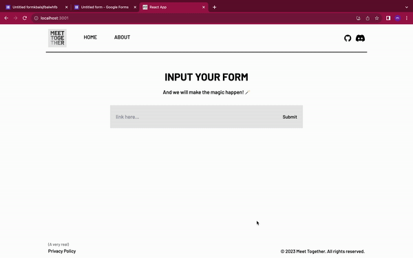

# Meet Together

## Inspiration
We were inspired mainly by When2meet. Seeing how technology could be used to piece together schedules, and more importantly connect people, gave us the idea to attempt to improve how we organize and group people together. From walking into a new classroom to forming project groups, shared interests and values are important pieces of data that can help us make better predictions as to compatible members and ideas.

## What it does
Meet Together leverages data from Google Forms and customizable surveys to streamline the process of organizing events and groups. By utilizing this data, it saves valuable time for organizers and users while boosting productivity.

## How we built it
We built Meet Together using React, which allowed us to create an interactive and responsive web application. We also integrated Google Forms data, enabling seamless data collection and management. The customization and flexibility of React played a pivotal role in developing a user-friendly experience.

## Challenges we ran into
During the development of Meet Together, we encountered several challenges. These included handling and processing data from Google Forms, creating a smooth user experience, and designing and implementing a complex algorithm to predict compatibility. Additionally, accounting for all possibilities in a highly customizable survey system presented its own set of challenges. Addressing these issues required careful planning and collaborative problem-solving.

## Accomplishments that we're proud of
We take pride in the successful implementation of our algorithm that helps users form groups and make connections based on shared interests and values. Additionally, we're proud of the user-friendly interface we've created, which simplifies the process of organizing events and groups.

## What's next for Meet Together
The future for Meet Together is promising, and we have several exciting plans in store:

We want to integrate OAuth 2.0 so that any users can use our website with their own form data.

Our goal is to begin using NLP models to allow for organizers to utilize text boxes within their forms. With this, we could match common keywords found in user responses, deepening the complexity of our matching algorithm.

**Technologies and Libraries:**
- **Google Cloud**
- **Google Forms**
- **JavaScript**
- **OAuth**
- **React**
- **Tailwind CSS**
